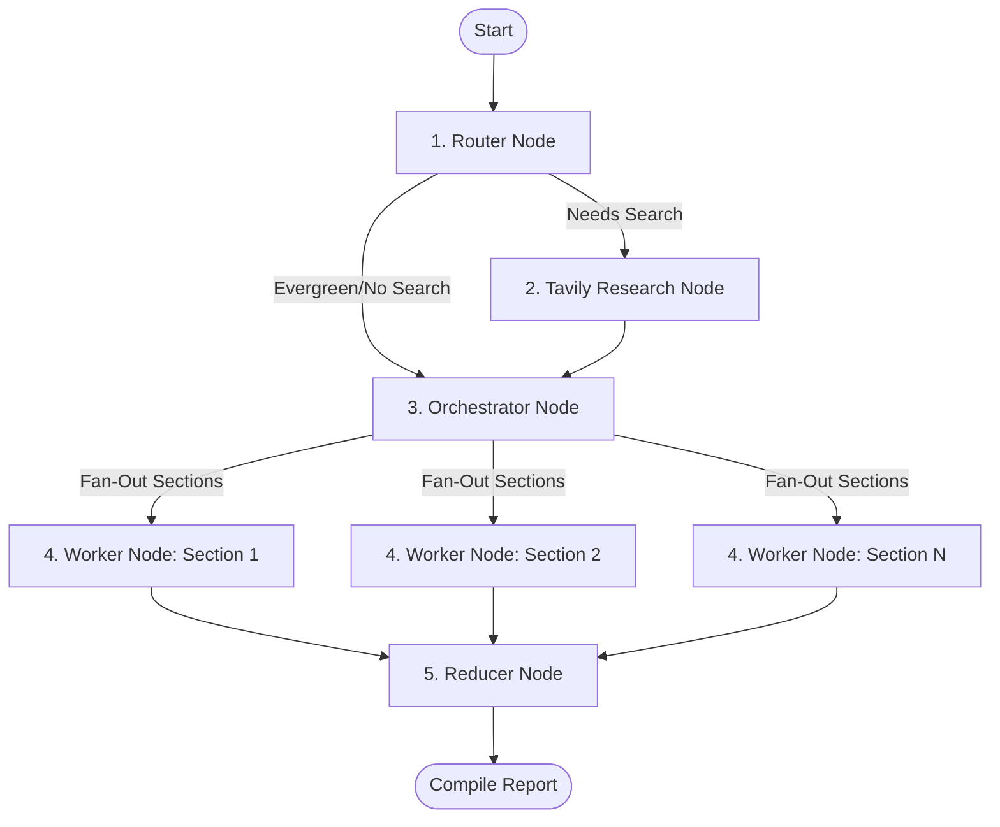

# Multi-Agent Research Assistant

An intelligent, multi-agent research assistant that generates comprehensive, professional, and cited markdown research reports on any topic. 

Built using a **FastAPI** backend with **LangGraph** (StateGraph) coordinating a multi-agent flow, and a **Vite + React + TypeScript** frontend with a responsive progress-tracking dashboard.

---

## Architecture Flow

The backend implements a **Router → (Research) → Orchestrator → Parallel Workers → Reducer** agentic pattern:



1. **Router**: Analyzes the topic and decides if web research is required. Selects the mode (`closed_book`, `hybrid`, or `open_book`) and generates search queries.
2. **Research (Tavily)**: Executes queries using Tavily, deduplicates results, and filters them based on recency.
3. **Orchestrator**: Defines a structural plan (5-8 sections, titles, specific questions, constraints, and citation/data requirements).
4. **Worker**: Generates detailed content for each section in parallel, using facts and figures cited from the evidence.
5. **Reducer**: Sorts and compiles the sections, formats reference lists, builds an executive summary, and outputs the final markdown document.

---

## Technology Stack

### Backend
- **Core Orchestrator**: LangGraph (for stateful multi-agent flow control)
- **Framework**: FastAPI (high-performance async API)
- **Primary LLM**: Mistral AI (`mistral-small-2506` with Pydantic structured output parsing support)
- **Fallback LLM**: Groq (`llama-3.3-70b-versatile`)
- **Web Search**: Tavily Search API

### Frontend
- **Bundler**: Vite
- **Libraries**: React, TypeScript, Lucide Icons
- **Styling**: Premium Custom Vanilla CSS (Dark glassmorphism, responsive cards, clean typography)
- **State**: Custom react hooks caching research histories in local storage

---

## Getting Started

### Prerequisites
- Python 3.9+
- Node.js 18+

### 1. Setup Backend
1. Navigate to the root directory.
2. Create a virtual environment and activate it:
   ```bash
   python -m venv .venv
   # Windows:
   .venv\Scripts\activate
   # macOS/Linux:
   source .venv/bin/activate
   ```
3. Install dependencies:
   ```bash
   pip install -r requirements.txt
   ```
4. Create a `.env` file in the root directory:
   ```env
   MISTRAL_API_KEY="your-mistral-api-key"
   GROQ_API_KEY="your-groq-api-key"
   TAVILY_API_KEY="your-tavily-api-key"
   ```
5. Start the FastAPI server:
   ```bash
   python research.py
   ```
   The backend will run on `http://localhost:8000`.

### 2. Setup Frontend
1. Navigate to the frontend folder:
   ```bash
   cd research_frontend
   ```
2. Install npm packages:
   ```bash
   npm install
   ```
3. Start the dev server:
   ```bash
   npm run dev
   ```
   Open `http://localhost:5173` in your browser.

---

## Features
- **Intelligent Routing**: Determines if web search is needed based on query freshness.
- **Robust Schema Parsing**: Utilizes Pydantic schemas for structuring reports, sections, and search results.
- **Dynamic Progress Tracker**: Displays real-time status as the backend cycles through execution nodes.
- **Persistent History**: Keeps track of generated reports locally.
- **Markdown Output**: Generates beautifully structured articles with tables, citations, bullet points, and headers.
